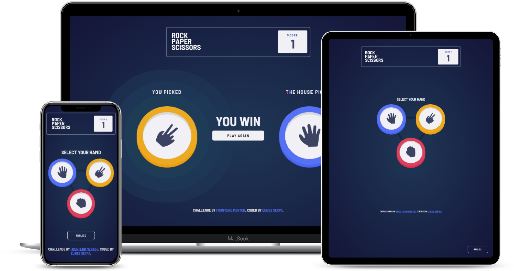

# Frontend Mentor - Rock, Paper, Scissors solution

This is a solution to the [Rock, Paper, Scissors challenge on Frontend Mentor](https://www.frontendmentor.io/challenges/rock-paper-scissors-game-pTgwgvgH). Frontend Mentor challenges help you improve your coding skills by building realistic projects. 

## Table of contents

- [Frontend Mentor - Rock, Paper, Scissors solution](#frontend-mentor---rock-paper-scissors-solution)
  - [Table of contents](#table-of-contents)
  - [Overview](#overview)
    - [The challenge](#the-challenge)
    - [Rules](#rules)
      - [Original](#original)
    - [Screenshot](#screenshot)
    - [Links](#links)
  - [My process](#my-process)
    - [Built with](#built-with)

## Overview

### The challenge

Your challenge is to build out this Rock, Paper, Scissors game and get it looking as close to the design as possible.

Users should be able to:

- View the optimal layout for the game depending on their device's screen size
- Play Rock, Paper, Scissors against the computer
- Maintain the state of the score after refreshing the browser _(optional)_

### Rules

If the player wins, they gain 1 point. If the computer wins, the player loses one point.

#### Original

- Paper beats Rock
- Rock beats Scissors
- Scissors beats Paper

### Screenshot

### Links

- Repository URL: [Github](https://your-solution-url.com).
- Live Site URL: [See demo](https://fm-rock-paper-scissors-sc.netlify.app/).

## My process

### Built with

- Semantic HTML5 markup
- CSS custom properties
- Flexbox
- CSS Grid
- Mobile-first workflow
- JavaScript
